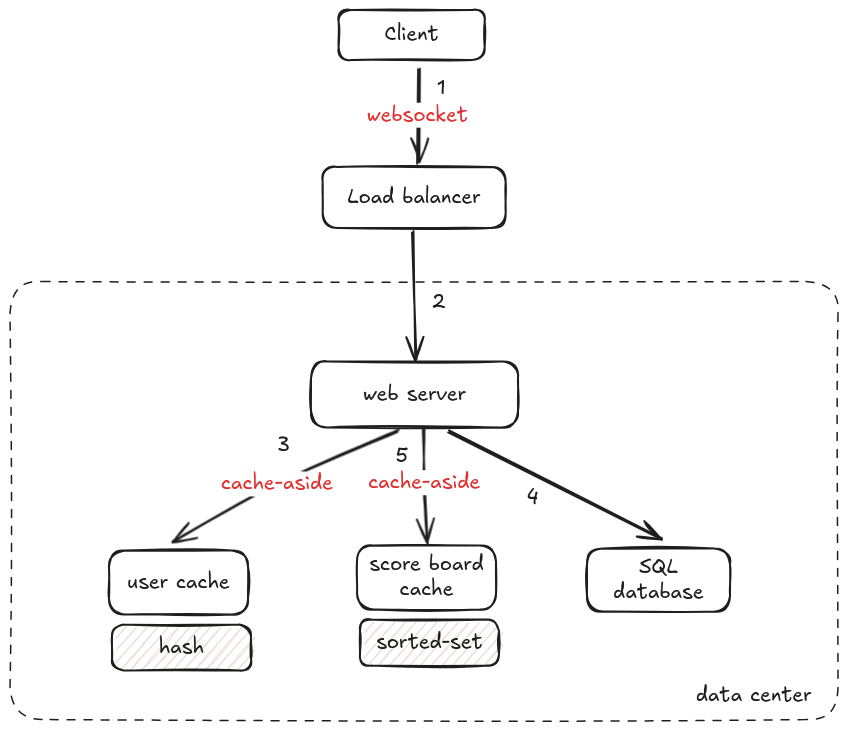
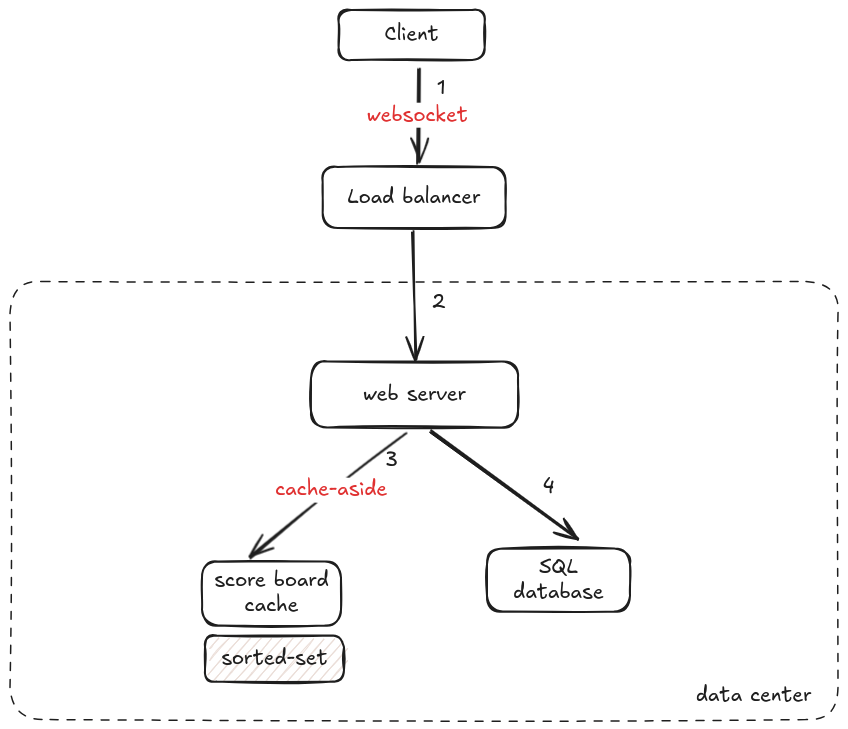

# API Service Module Specification

## Overview

This module will handle real-time updates to the score board, ensuring top scores are displayed live on the website. The service supports high traffic, with a read-heavy workload. The API must ensure data integrity and prevent unauthorized score modifications.

## Note

The functional and non-functional requirements listed below are my assumptions based on the problem statement.

## Functional Requirements

1. **Real-Time Score Updates:**

   - The score board displays the top 10 users with the highest scores.
   - The score board updates in real-time upon score changes.

2. **Score Update Endpoint:**

   - API endpoint to update user scores securely.
   - Prevent unauthorized score updates.

## Non-Functional Requirements

1. **High availability**
2. **Low latency**
3. **Scalability**
4. **Reliability**
5. **Minimal operational overhead**

---

## API Endpoints

### 1. **Update Score**

**Endpoint:** `POST /api/v1/score`

**Description:** Updates the score of a user after completing an action.

**Request Body:**

```json
{
  "userId": "string",
  "score": "integer",
  "authToken": "string"
}
```

**Response:**

- **200 OK**
  ```json
  {
    "status": "success",
    "newScore": "integer"
  }
  ```
- **400 Bad Request:** Invalid data.
- **401 Unauthorized:** Invalid or missing authentication.
- **500 Internal Server Error:** Server issue.

**Validation:**

- `userId` and `authToken` must be valid and authorized.
- `score` should be a positive integer.

---

### 2. **Get Top 10 User's Scores**

**Endpoint:** `GET /api/v1/score board`

**Description:** Fetches the top 10 users by score.

**Response:**

- **200 OK**
  ```json
  [
    { "rank": 1, "userId": "string", "score": "integer" },
    { "rank": 2, "userId": "string", "score": "integer" },
    ...
  ]
  ```
- **500 Internal Server Error:** Server issue.

---

## System Design

### Flow of Execution

1. **Score Update:**

   - User completes an action on the client-side.
   - Client sends a `POST /api/v1/score` request.
   - API validates the request and updates the user's score.
   - The score board cache updates asynchronously.

2. **Top User's Scores Display:**

   - Clients request the score board via `GET /api/v1/:count`.
   - The API serves data from a real-time cache or in-memory database.

### Architecture

1. **Data Storage:** The read: write ratio is 5:1, making the score board a relatively write-heavy system.

   #### Relational Database Schema

   - Users Table:
     - userId (Primary Key, UUID): Unique identifier for each user.
     - userName (String): Name of the user.
     - gameId (Foreign Key): Links to the game in the Game table.
   - Scores Table:
     - scoreId (Primary Key, UUID): Unique identifier for the score entry.
     - userId (Foreign Key): Links to the user in the Users table.
     - gameId (Foreign Key): Links to the game in the Game table.
     - score (Integer): The user's score.
     - lastUpdated (Timestamp): Timestamp of the last score update.
   - Game Table:

     - gameId (Primary Key, UUID): Unique identifier for the game.
     - gameName (String): Name of the game.

     The major entities of the relational database are the Users, Scores, and Game tables. The relationship between the Game and Scores tables is a **1-to-many** relationship, where each game can have multiple scores. The relationship between the Users and Scores tables is a **1-to-many** relationship, where each user can have multiple scores. The relationship between the Users and Game tables is a **1-to-many** relationship, where each user can have multiple games.

   #### Redis Schema

   - Users (Hash):

     - userId (Key): Unique identifier for the user.
     - userName: Name of the user.
     - gameId: Links to the game in the Game table.

   - Scores (Sorted Set):

     - scoreId, gameId (Key): Unique identifier for the score entry.
     - userId: Links to the user in the Users table.
     - score: The user's score.
     - lastUpdated: Timestamp of the last score update.

     The major entities of the in-memory database (Redis) are the Users and Scores. The sorted set is used to store the score board data and the hash is used to store the user data. The key of sorted set is the gameId and the scoreId. The key of the hash is the userId.

2. **High-level design**

   #### Score Update Workflow

   A small-scale score board can leverage the cache-aside pattern on the caching layer for the relational database. The following operations are performed when a user updates the score:

   

   1. The client creates a WebSocket connection to the load balancer for real-time communication
   2. The load balancer delegates the client's request to the closest data center
   3. The server validates the user's score update request by checking the user's authentication token and user ID in the cache (When the user logs in, the server stores user ID in the cache)
   4. The server updates the user's score record on the relational database following the cache-aside pattern
   5. The server updates the same user's score record on the cache server following the cache-aside pattern

   #### Score Board Display Workflow

   The following operations are performed when a user wants to view the score board:

   

   1. The client creates a WebSocket connection to the load balancer for real-time communication
   2. The load balancer delegates the client's request to the closest data center
   3. The server queries the cache server for the top 10 users' scores
   4. The server queries the relational database on the cache miss and populates the cache with fetched data

## Improvements

### Score Update

Web services can be substituted with serverless functions for minimal operational overhead. The cache server and relational database should be configured for active-active geo-replication to enable each data center to accept writes. A global load balancer can be provisioned to distribute the client requests. The stateless web server can be replicated across data centers for scalability. The following operations are performed when a player updates the score:

1. The client creates a WebSocket connection to the load balancer for real-time communication
2. The load balancer delegates the client's request to the closest data center
3. The server updates the score on the sorted set data type in Redis
4. The serverless function updates the records on the relational database using the write-behind cache pattern

### Score Board Display

The following operations are performed when a player wants to view the score board:

1. The client creates a WebSocket connection to the load balancer for real-time communication
2. The load balancer delegates the client's request to the closest data center
3. The serverless function invokes the sorted set data type in Redis
4. The serverless function queries the relational database on a cache miss using the read-through cache pattern
